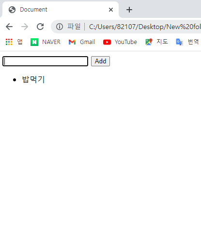
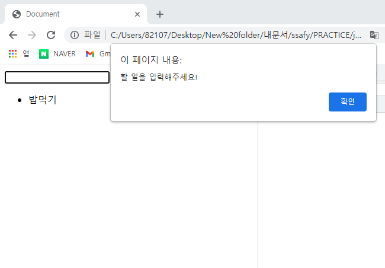

1027 


1.  todo list 동작

   

2.  빈칸입력시 경고창 팝업





3. 코드 

   ```html
   <!DOCTYPE html>
   <html lang="en">
   <head>
     <meta charset="UTF-8">
     <meta http-equiv="X-UA-Compatible" content="IE=edge">
     <meta name="viewport" content="width=device-width, initial-scale=1.0">
     <title>Document</title>
   </head>
   <body>
     <form action="#">
       <input type="text">
       <button>Add</button>
     </form>
     <ul>
   
     </ul>
   
     <script>
       const form = document.querySelector('form')
       
       const addTodo = function (event) {
         event.preventDefault()
   
         const input = document.querySelector('input')
         const content = input.value
   
         if (content.trim()) {
           const liTag = document.createElement('li')
           //  submit 테그이기때문에 event 값이 아닌 input.value가 들어가야한다.
           liTag.innerText = input.value
     
           const ulTag = document.querySelector('ul')
           ulTag.appendChild(liTag)
   
         } else{
           alert('할 일을 입력해주세요!')
         }
   
         // add 추가하면 input value 초기화
         event.target.reset()
         
       }
   
       form.addEventListener('submit', addTodo)
       
     </script>
   </body>
   </html>
   ```

   

